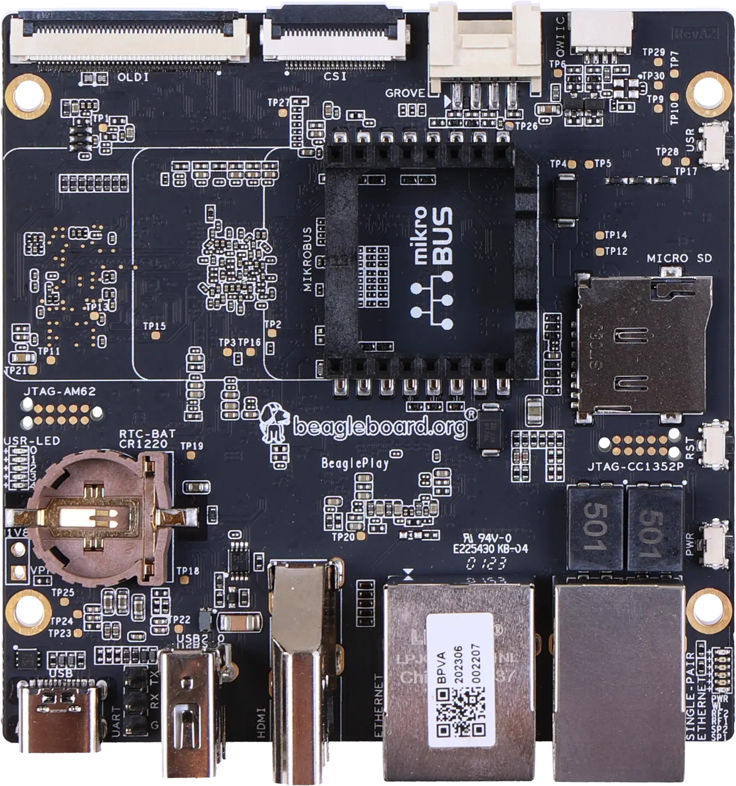
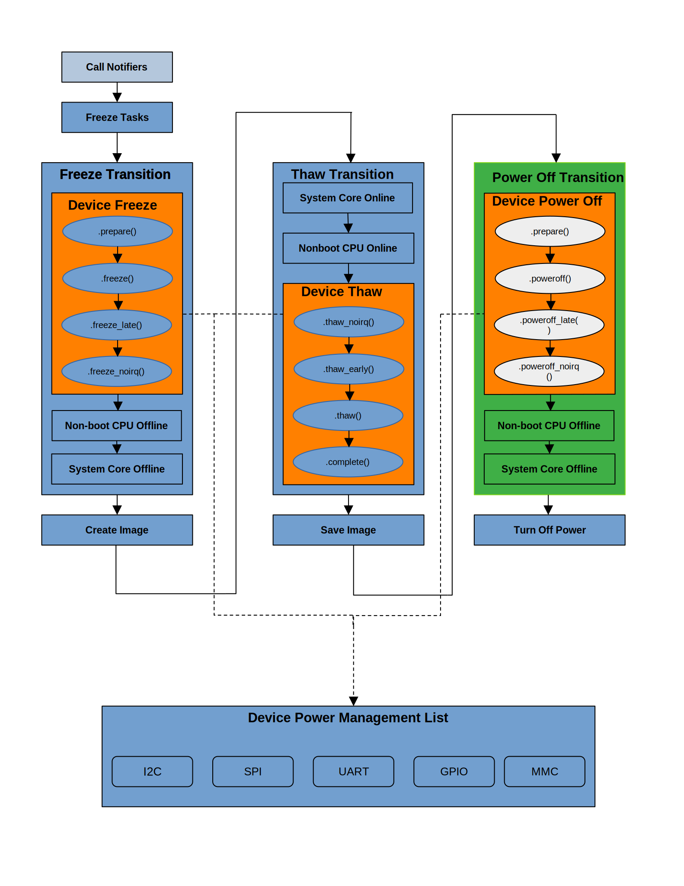
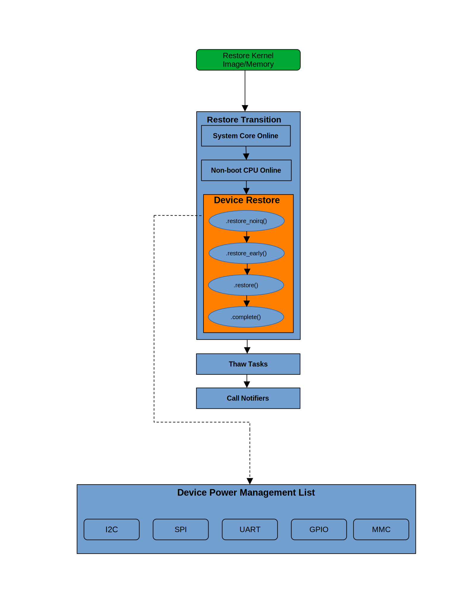

# Suspend-to-Disk / Hibernation on TI’s AM625 Based BeaglePlay SBC

Image Reference - References:- 1)

## About
This enables the support for Suspend to Disk/hibernation on AI64/AM62X.  
I did this project as an individual contributor with mentoring from Beagleboard.org and Texas Instruments Engineers.  
Mentors:- Nishanth Menon, Dhruva Gole, Robert Nelson

### About me:-
- _Name_:-   	Sukrut Bellary
- _IRC_	:-     	sukrutb
- _Github_:-  	[sukrutb](https://github.com/sukrutb)

## Description:-
**Hardware:-**  

**BeaglePlay:-** [BeaglePlay](https://beagleboard.org/play  )  

**SoC:- TI AM625** => [TI AM625](https://www.ti.com/product/AM625)

## Overview:-
This project aims to enable Suspend-to-Disk/Hibernation on AI64/AM62X – BeaglePlay.

## Benefit:-
Hibernation mode saves the system's current state to non-volatile memory, meaning the data is preserved even if the system loses power. This is particularly useful in embedded systems where data must be maintained across power cycles while achieving maximum power saving.

## Hibernation:-
Hibernation of the system is one of the techniques of power management where the System/System on Chip (SoC) is powered down while retaining its state. When hibernation is triggered, the Kernel freezes all the system activities. Then, it creates and stores the snapshot of Random Access Memory (RAM) to non-volatile memory(NVM).

The Flow of the Hibernation is depicted below.
Device Power Management list is the list of callbacks provided by all the device drivers on an SoC using struct dev_pm_ops or DEFINE_SIMPLE_DEV_PM_OPS.

Each device driver registers this with PM core. During Hibernation, the PM core calls these callbacks during Device Freeze, Device Thaw, and Device Off transitions.  
At this stage, the device driver saves its context so that it can be retained during the restore phase.

## Wake-up/Resume:-
Upon wake-up, restore the snapshot image so that the system state will be the same as before Hibernation.
This flow is from the Restore Kernel Image stage.  

## Implementation Details:-
System hibernation can be triggered via the sysfs interface, e.g., echo disk > /sys/power/state 
This triggers the Linux kernel's hibernate(), wherein  
1. User space processes are frozen.
2. Devices on the SoC are put in suspension (by calling their respective freeze callbacks).
3. Put Non-boot CPU cores and System core offline.
4. Create the hibernation snapshot.
5. Bring System Core, non-boot CPUs, and devices online. (by calling respective thaw callbacks).
6. Store the hibernation snapshot in non-volatile memory. (Need to pass the NVM partition information to the Kernel).
7. invoke power_down().

Resume:- The power-on button triggers the wake-up event.  
Here, the Kernel loads the hibernation snapshot from NVM, which restores the system state.

## Power Management flow on TI’s AM62x:-
[TI's S/W Architecture of System Suspend](https://software-dl.ti.com/processor-sdk-linux/esd/AM62X/08_06_00_42/exports/docs/linux/Foundational_Components/Kernel/Kernel_Drivers/Power_Management/pm_sw_arch.html)

Though this is for Suspend-To-RAM/S2RAM, most details are shared with Suspend-To-Disk.

## Validation:-
I started with the minimal device tree configuration for AM625x BeaglePlay
with peripherals i.e., UART0-Console, I2C0- PMIC, gpio1, SD/MMC1, CPU core 0.
This is to validate if the Hibernation image save and restore works fine with minimal peripherals‘ freeze and restore.
e.g., - In the case of GPIO, context is saved during hibernation/freeze using  
**davinci_gpio_suspend()** -> **davinci_gpio_save_context()**  
And it’s restored on resume/restore  
**davinci_gpio_resume()** -> **davinci_gpio_restore_context()**

**Prepare the system for Hibernation**
We currently use the SD card as the SWAP partition source for Hibernation.

Resize the rootfs partition and create a new partition for SWAP(mark it as swap)

**Prepare swap partition**  
mkswap /dev/<`swap parttion`>  

**Activate swap partition**  
swapon /dev/<`swap parttion`>  
e.g. # swapon /dev/sdc3

Note Down the UUID of a swap partition.

To enable this swap partition on boot, add an entry to BeaglePlay’s roofs /etc/fstab:
UUID=<<swap UUID>> none swap defaults 0 0

On the target BeaglePlay,  
remove the image_size restriction when we create the hibernation image.<`Just for initial testing`>  
echo 0 > /sys/power/image_size

	Setting up kernel parameters – append resume=UUID=<swap UUID>

In Target's /BOOT/extlinux/extlinux.conf  
e.g.  
append root=/dev/mmcblk1p2 ro rootfstype=ext4 resume=UUID=<`swap UUID`> rootwait net.ifnames=0 quiet initcall_debug

To immediately enable hibernation without rebooting, append SWAP volumes major and minor device numbers to /sys/power/resume
e.g., echo 8:3 > /sys/power/resume

**_Ref Links_**:-  
- [Suspend_and_hibernate](https://wiki.archlinux.org/title/Power_management/Suspend_and_hibernate)  
- [Swap](https://wiki.archlinux.org/title/Swap)

I have created the script on the target, which I execute to put the device into Hibernation.  

============  
	hibernation.sh  
 	#!/bin/bash  
	
	#enable dbg logs (Optional – Only for debugging)  
	echo 'file main.c +p'>/sys/kernel/debug/dynamic_debug/control  
	echo 'file hibernate.c +p'>/sys/kernel/debug/dynamic_debug/control  
	echo 'file domain.c +p'>/sys/kernel/debug/dynamic_debug/control  
	  
	echo 8 > /proc/sys/kernel/printk  
	echo 0 > /sys/power/image_size  
	  
	echo N | sudo tee /sys/module/printk/parameters/console_suspend  
	
	echo disk > /sys/power/state  
 
 ============  

**Device Context Restore and Save:-**  
1) To validate, read the device registers before Hibernation.
   And read the same device registers after restoring to check if they match with values at the time of Hibernation.
   e.g., **gpio1** – Provide the base address and run script with register offset to read all gpio1 registers.

============  

 	base_address=6295552  
 	offset=0  
  	addr=0  
   
	while [ $offset -lt 216 ]
	do  
 		echo "Register address = $base_address offset = $offset"  
		devmem2 $base_address  
		base_address=`expr $base_address + 4`  
		offset=`expr $offset + 4`  
	done  
============  

2) Also, set one of the **GPIOs** from **GPIO bank 1** before Hibernation.
   Validate if that GPIO retains the state after restore.

**Issues:-**  
1) There was an issue where Secondary/Non-boot CPUs were not coming online during thaw and restore.
   The following TF-A patch is required to fix this.  
   [TF-A Patch](https://review.trustedfirmware.org/c/TF-A/trusted-firmware-a/+/227996)

2) During thaw, WiFi fails to come online.
   I have debugged the issue, and it looks like, during freeze/suspend, WL_EN line is not put to low ‘0’ to power down the WiFi. 
   During restore, the WiFi driver tries to load the FW and fails.  
   **Log:-**  
   	[Log WiFi Thaw Failure](https://gist.github.com/sukrutb/8b02a9ffa7bd1cb9fb514220e9af097e)

Per dts, the WL_EN pin, which goes to the WiFi chipset enable, is configured as Regulator, which is regulator-always-on.  
So, this line doesn’t go low during suspend, and the WiFi chipset is not powered down.  
To fix this, per my understanding. We need to configure it as regulator-off-in-suspend. With these changes, I don’t see any WiFi failure during thaw, i.e., firmware loading failure.

  **Patch**  
  
  =================
  
	  diff --git a/arch/arm64/boot/dts/ti/k3-am625-beagleplay.dts b/arch/arm64/boot/dts/ti/k3-am625-beagleplay.dts
	  index 7cfdf562b53b..a80888342446 100644
	  --- a/arch/arm64/boot/dts/ti/k3-am625-beagleplay.dts
	  +++ b/arch/arm64/boot/dts/ti/k3-am625-beagleplay.dts
	  @@ -109,7 +109,8 @@ wlan_en: regulator-3 {
	                  regulator-min-microvolt = <1800000>;
	                  regulator-max-microvolt = <1800000>;
	                  enable-active-high;
	  -               regulator-always-on;
	  +               /regulator-always-on;/
	  +               regulator-off-in-suspend;
	                  vin-supply = <&vdd_3v3>;
	                  gpio = <&main_gpio0 38 GPIO_ACTIVE_HIGH>;
	                  pinctrl-names = "default";

  =================  
  
**Pending Items:-**  
1) Need to validate with the swap partition on eMMC.

**_References_:-**  
A big Thank You to my mentors for the opportunity, guidance, and  
Beagleboard.org, Texas Instruments, ARM, and  
Linux PM developers for great documents and training sessions which are freely available.

1) **Kernel Recipes 2015** - Introduction to Kernel Power Management - by Kevin Hilman  
   	[Introduction to Kernel Power Management](https://www.youtube.com/watch?v=juJJZORgVwI)  
2) [generic-power-domains](https://baylibre.com/generic-power-domains/)  
3) **_Hibernation_:-**  
   	[Suspend_and_hibernate](https://wiki.archlinux.org/title/Power_management/Suspend_and_hibernate)  
4) **_BKK19-TR02 - Linux Kernel Power Management - 101_:-**  
   	[Linux Kernel Power Management - 101](https://www.youtube.com/watch?v=lpzniFSLDqs&t=2214s)  
5) [linux_pm_challenges](https://blog.linuxplumbersconf.org/2017/ocw/system/presentations/4652/original/linux_pm_challenges.pdf)  
6) **_BKK19-119 - Device power management and idle_:-**  
   	[Device power management and idle](https://www.youtube.com/watch?v=LaFartS_dv0&t=2472s)  
7) **_SWAP_:-**  
   	[SWAP](https://wiki.archlinux.org/title/Swap)

